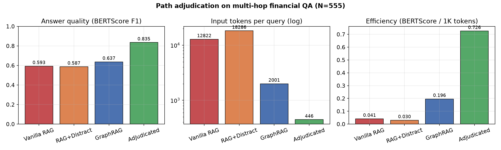
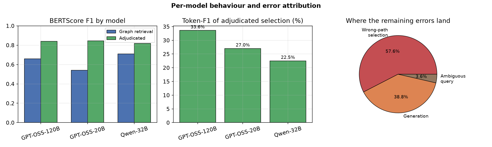
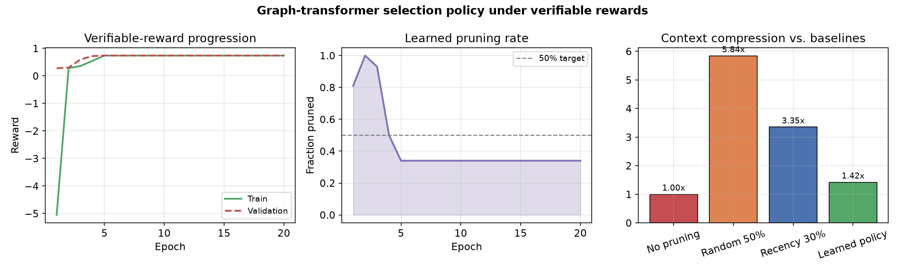

# Combinatorics of Trust over Knowledge Graphs

Multi-hop question answering over a knowledge graph usually gets framed as retrieval: fetch a relevant subgraph, hand it to a language model, hope for the best. Fetching turns out to be the easy part. A single question will typically admit dozens of candidate reasoning chains, and most of them don't survive inspection — they're stale, they route through some hub entity that connects to everything, or they assert an effect that nothing in the graph actually supports. To a relevance score they all look equally retrievable.

So the interesting question isn't what to fetch. It's what to trust.

This repository holds the code for two attempts at answering that, from opposite directions. One scores the internal coherence of an evidence chain in closed form and selects on it. The other learns a selection policy directly, with reinforcement learning, and lets the reward function decide what coherence means. They share a premise: choosing evidence under a budget is a combinatorial optimization problem, and it's worth treating it as one.

---

## The selection problem

Both halves reduce to the same setup. You have a temporal multigraph `G = (V, E)` — entities as vertices, and edges that are directed, typed, timestamped, and signed, so an ordered pair can carry several different relations across different years. You enumerate candidate paths between anchor entities under a hop budget. Then you pick a subset.

Formally: let `x_p ∈ {0,1}` select path `p`, let `P` be how many paths fit in the generator's context, and let each path cover some set of claims. Maximizing claim coverage weighted by path quality, subject to `Σ x_p ≤ P`, is **monotone submodular** — which makes exact selection NP-hard by reduction from Maximum Coverage, and makes greedy selection provably within `1 − 1/e` of optimal.

That bound is the reason this framing earns its keep. You get a hard guarantee on a problem that otherwise invites unprincipled heuristics.

There's a special case worth knowing: when each claim has exactly one witnessing path, the objective collapses from submodular to modular, and the optimum is just the top `P` paths ranked by individual score. The experiments here run top-`P` selection, which means they're exactly optimal when that condition holds and a greedy approximation when it doesn't.

---

## `/adjudication` — scoring coherence in closed form

The first approach scores how well the hops of a single path support *each other*, using the residuum from Łukasiewicz logic. Each edge carries a truth value in `[0,1]` grading its relevance and recency; a small set of typed implications gets evaluated against the path; satisfaction has a closed form.

The point of the closed form is that there's no inner solver. Related work in this space — Hinge-Loss Markov Random Fields, Probabilistic Soft Logic — measures rule violation by fitting a joint field over all the evidence at once, which is convex but not free. Here each path is scored on its own and the optimization moves to *selection*. The truth values live in a residuated lattice whose order the score respects, which is what fixes the direction trust moves in: more support can't lower the score.

Evaluated on a multi-hop QA benchmark built over SEC filings, 555 questions, three generator models, 6,660 inference calls.



Model-averaged token-F1 comes to **27.7%**, against 25.0% for vanilla RAG (+2.7, *p* = 2.2×10⁻⁴) and 25.9% for graph retrieval with no scoring step (+1.8, *p* = 7.1×10⁻⁵). Both by two-sided Wilcoxon signed-rank over paired per-question scores.

The efficiency number is the one I'd point at. That accuracy comes from **446 input tokens** per query, against 12,822 for vanilla RAG — roughly a twenty-ninth of the input — because the budget gets spent on a handful of coherent paths instead of on volume. Stuffing *more* text in actively hurt: the distractor condition landed below plain RAG.



Where the failures land matters more than the headline. **57.6% are wrong-path selection** — the pipeline trusting structurally plausible chains that don't match the facts — against 38.8% generation error. The difficulty sits in the combinatorial problem, not in the language model, which is what the framing predicts and a decent sign the framing is right. It also points at the headroom: top-`P` ranks by relevance and applies the consistency score afterward, so the claim-coverage couplings that make the objective submodular in the first place go unexploited.

**Caveat worth stating plainly.** The gap over graph retrieval bundles three changes at once — re-ranking, consistency tagging, and chain-of-thought formatting. It measures the adjudication stage as a whole and does not isolate the contribution of the residuum. That would need a component ablation, which isn't run here.

## `/selection` — learning the policy instead

The second approach drops the hand-specified rules. Rather than deriving a coherence score, it trains a **heterogeneous graph transformer** to make selection decisions directly, optimized with PPO and generalized advantage estimation under verifiable rewards — reward computed from whether the retained context actually produced the right answer, not from a learned preference model.

The substrate is meeting transcripts (QMSum) rather than filings, built into a fact graph with succession, contradiction, and relatedness edges. Same problem shape, different domain: long context, mostly irrelevant, and a budget.



The reward converges in about five epochs with train and validation tracking closely. The pruning-rate panel is the informative one: given a 50% sparsity target, the policy settles at **34%** — it declines to throw away as much as it was asked to. Set against baselines that compress far more aggressively (random at 5.84×, recency at 3.35×), the learned policy sits at 1.42×, keeping substantially more context than either.

Read honestly, that's a policy that has learned retention is cheaper than a wrong answer. Compression ratio on its own is a bad target — random pruning wins it outright and is useless. The learned behaviour is the interesting result, not the ratio.

An ablation in the notebook compares the full graph construction against a lightweight pruning heuristic with no graph at all. The graph is not always worth its cost, and the notebook says so.

---

## Layout

```
adjudication/   pipeline.ipynb      graph construction, path enumeration,
                                    closed-form scoring, evaluation harness
selection/      pipeline.ipynb      fact graph, HGT policy, PPO/GAE training loop
                construct_kg.py     transcripts → typed fact graph
                process_dataset.py  preprocessing
                spacy_example.py    entity extraction
                test_gliner2.py     NER experiments
figures/                            result plots
```

Both pipelines are notebooks because both are research artifacts — the exploration, the dead ends, and the ablations are the useful part, and flattening them into a clean library would throw away the reasoning that produced the numbers.

## Running it

```bash
pip install rustworkx faiss-cpu sentence-transformers torch numpy scipy
export GEMINI_API_KEY="..."     # only needed for the generation step
jupyter notebook adjudication/pipeline.ipynb
```

Graph construction, indexing, and the retrieval pipeline were run on a single RTX 4090; generators were queried as hosted endpoints. The benchmark data and prebuilt graph indices aren't in the repo — they're large, and the construction scripts rebuild them from source.

## Limitations

Reasoning is confined to what's in the graph, so a missing entity sends the pipeline to a dense-retrieval fallback that can be factually wrong — this drives the wrong-path failures above. Rules and weights are hand-set rather than learned from labeled violations. Evaluation covers one benchmark, one domain, and a fixed 2-hop budget. The submodular machinery is proved and then only partly used, since top-`P` ignores the couplings that motivate it.

---

Some of the methodology here was developed jointly with **Nisarg Patel (Google Research)**, whose input shaped the selection formulation in particular.

Built on public SEC filings and public benchmark data. No private data was used. This is research code and not financial advice — graph errors and model fabrications can mislead regardless of what the consistency score says.
